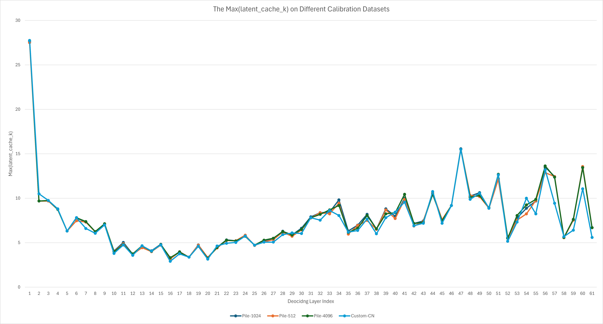
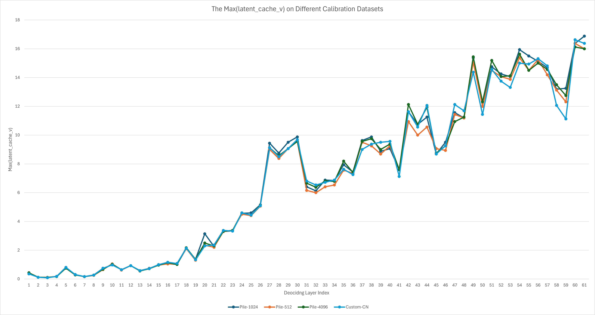

# BKC for Quantizing DeepSeek V3/R1 with vLLM and INC

<!-- TOC -->

- [BKC for Quantizing DeepSeek V3/R1 with vLLM and INC](#bkc-for-quantizing-deepseek-v3r1-with-vllm-and-inc)
    - [Support Matrix](#support-matrix)
    - [Setting Up a Two-Node Environment](#setting-up-a-two-node-environment)
        - [Prerequisites](#prerequisites)
        - [Install Dependencies](#install-dependencies)
        - [Exporting Environment Variables](#exporting-environment-variables)
    - [Calibration](#calibration)
    - [Inference with FP8 Models on Two Nodes](#inference-with-fp8-models-on-two-nodes)
    - [Inference with FP8 Models on a Single Node](#inference-with-fp8-models-on-a-single-node)
        - [Prerequisites](#prerequisites)
        - [Running the Example](#running-the-example)
    - [Calibration with Custom Dataset](#calibration-with-custom-dataset)
    - [Accuracy Evaluation WIP](#accuracy-evaluation-wip)
        - [Ablation Study on Calibration Datasets](#ablation-study-on-calibration-datasets)

<!-- /TOC -->

This document outlines the steps to use vLLM and INC for calibrating DeepSeek R1 on two nodes environment, and performing quantization and inference on both two-node and single-node environments.

## Support Matrix

- Calibration Stage (Two Nodes)

| KVCache Precision | Configurations |
|---|---|
| BF16              | `inc_measure_config.json`         |
| FP8               | `inc_measure_with_fp8kv_config.json`|

- Quantize/Inference Stage

| KVCache Precision | Two Nodes Configurations | One Node Configurations |
|---|---|---|
| BF16              | `inc_quant_config.json`          | `inc_quant_one_node_config.json`|
| FP8               | `inc_quant_with_fp8kv_config.json`| `inc_quant_with_fp8kv_one_node_config.json`|


## Setting Up a Two-Node Environment
>
> [!NOTE]
> If you want to quantize the model using existing calibration results, you can skip this section and proceed directly to the `Inference with FP8 Models on a Single Node` section.

We use Ray to establish a two-node cluster to simulate a system with 16 HPUs and update the procedure accordingly. It is crucial that both nodes use an identical software stack. Docker containers are used to ensure a consistent environment. The high-level steps are as follows:

- Build and run Docker on each node.
- Export the necessary environment variables within each Docker container.
- Start the Ray cluster on the head node, then connect the worker node to it.

For more details, please refer to the <https://github.com/yangulei/vllm-fork/blob/deepseek_r1_g2/scripts/multi_nodes_README.md>

### Prerequisites

- Hardware: 2x8G2 or 2x8G3
- Docker: 1.20.0-521

### Install Dependencies

- INC https://github.com/intel/neural-compressor/tree/dev/ds_r1

```bash
git clone https://github.com/intel/neural-compressor.git inc
cd inc
git checkout dev/ds_r1
pip install -r requirements.txt
pip install -r requirements_pt.txt
python setup.py pt develop
```

- vLLM https://github.com/yiliu30/vllm-fork/tree/dev/yi/ds_r1

```
git clone https://github.com/yiliu30/vllm-fork.git vllm
cd vllm
git checkout dev/yi/ds_r1
pip install -r requirements-hpu.txt
VLLM_TARGET_DEVICE=hpu pip install -e .  --no-build-isolation
```

- Model
  - DeepSeek R1 (BF16)
  - Conversion Script: `convert_fp8_to_bf16_cpu.py`

### Exporting Environment Variables
>
> [!NOTE]
> Please update the `VLLM_HOST_IP`, `HCCL_SOCKET_IFNAME` and `GLOO_SOCKET_IFNAME` variables in the `devices.conf` to match your devices.

- Head Node

```bash
source  head_node_source.sh
```

- Worker Node

```bash
source worker_node_source.sh
```

> [!TIP]
> - Ensure that Ray is started in the SAME directory within both Docker containers.
> - If you modify the environment variables, please RESTART Ray for the changes to take effect.

## Calibration

This process runs the BF16 model on a calibration dataset to observe the ranges of model weights and inputs.

> [!TIP]
> You can skip this step by downloading the pre-measured calibration result. Please refer to the inference section for more details.

- BF16 KVCache

```bash
# vllm root
cd vllm/scripts
export QUANT_CONFIG=inc_measure_config.json
# restart ray 
python inc_example_two_nodes.py --mode prepare
```

- FP8 KVCache
```bash
# vllm root
cd vllm/scripts
export QUANT_CONFIG=inc_measure_with_fp8kv_config.json
# restart ray 
python inc_example_two_nodes.py --mode prepare
```


## Inference with FP8 Models on Two Nodes

This script loads the BF16 model into DRAM, transfers  it to the HPU, and quantizes the model layer by layer.

- BF16 KVCache

```bash
cd vllm/scripts
# Optional: download the pre-measured calibration result.
huggingface-cli download Yi30/inc-2nodes-pile-1024-correct-311 --local-dir nc_workspace_measure
# vllm root
export QUANT_CONFIG=inc_quant_config.json
# restart ray
python inc_example_two_nodes.py --mode quant
```

- FP8 KVCache
```bash
cd vllm/scripts
# Optional: download the pre-measured calibration result.
huggingface-cli download Yi30/inc-2nodes-pile-1024-correct-311 --local-dir nc_workspace_measure_kvache
# vllm root
export QUANT_CONFIG=inc_quant_with_fp8kv_config.json
# restart ray
python inc_example_two_nodes.py --mode quant --fp8_kvcache
```

## Inference with FP8 Models on a Single Node

In this section, we load the BF16 model on DRAM and quantize it to FP8 model using unified measurement results obtained from the two-node calibration.

### Prerequisites

- Hardware: 1x8G3 or 1x8G2
- Docker: 1.20.0-521

### Running the Example

- BF16 KVCache
```bash
# vllm root
cd vllm/scripts
# Download the unified calibration results:
huggingface-cli download Yi30/inc-2nodes-pile-1024-correct-311-unified --local-dir nc_workspace_measure_one_node
QUANT_CONFIG=inc_quant_one_node_config.json python inc_example_one_node.py
```

- FP8 KVCache
```bash
# vllm root
cd vllm/scripts
# Download the unified calibration results:
huggingface-cli download Yi30/inc-2nodes-pile-1024-correct-311-unified --local-dir nc_workspace_measure_kvache_one_node
QUANT_CONFIG=inc_quant_with_fp8kv_one_node_config.json python inc_example_one_node.py --fp8_kvcache
```

> [!NOTE]
> If your DRAM is less than 2T, please use `LOW_CPU_MEM=1` to open layer-by-layer conversion.


## Calibration with Custom Dataset

> [!NOTE]
> Please update the `CALIBRATION_SAMPLE_LENGTH` to `4096` and `CALIBRATION_MAX_BATCH_SIZE` to `1` in the `devices.conf` before proceeding.

Taking the FP8 KVCache as an example, we can run the calibration procedure with the `tc` dataset as follows:

```bash
# vllm root
cd vllm/scripts
export QUANT_CONFIG=inc_measure_with_fp8kv_config.json
# restart ray 
python inc_example_two_nodes.py --mode prepare --dataset tc --dpatch /path/to/dataset --least_tokens 4096
```

## Accuracy Evaluation (WIP)

### Ablation Study on Calibration Datasets
To analyze the impact of the calibration dataset, we collect the maximum values of `latent_cache_k` and `latent_cache_v` across four different settings.

The results, illustrated below, show that the maximum values for key and value remain similar across different datasets and sample lengths.

- Pile-1024: Samples truncated to 1024 from [NeelNanda/pile-10k](https://huggingface.co/datasets/NeelNanda/pile-10k)
- Pile-512: Samples truncated to 512 from [NeelNanda/pile-10k](https://huggingface.co/datasets/NeelNanda/pile-10k)
- Pile-4096: Samples truncated to 4096 from [NeelNanda/pile-10k](https://huggingface.co/datasets/NeelNanda/pile-10k)
- Custom-CN: Samples truncated to 4096 from a custom Chinese dataset

- latent_cache_k



- latent_cache_k

